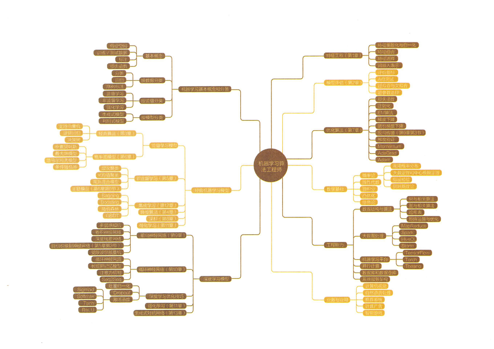
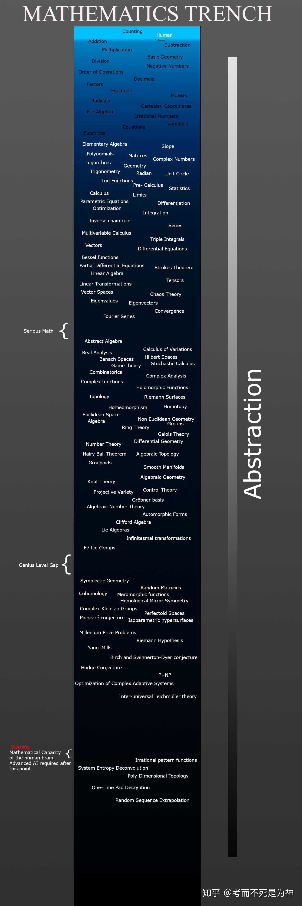

# Hello-Machine-Learning

本页汇集了机器学习相关的理论和实践学习内容。

# 我的机器学习笔记

## 机器学习框架

当前流行的机器学习框架，Scikit-learn, tensorflow, xgboost, keras, NLT, gensim, numpy, 基本上都能使用Python Anaconda安装。

TensorFlow
https://lucky521.github.io/blog/machinelearning/2017/10/26/tensorflow.html

XGBoost
https://lucky521.github.io/blog/machinelearning/2018/03/25/boosting.html

Scikit-Learn
https://lucky521.github.io/blog/machinelearning/2016/12/28/scikit-learn.html

## 机器学习方法

特征工程
https://lucky521.github.io/blog/machinelearning/2018/04/18/feature-engineering.html

模型评价
https://lucky521.github.io/blog/machinelearning/2017/01/01/metrics-to-evaluate-model.html

提升方法
https://lucky521.github.io/blog/machinelearning/2018/03/25/boosting.html

最优化方法
https://lucky521.github.io/blog/machinelearning/2018/07/31/optimization-method.html

深度学习
https://lucky521.github.io/blog/machinelearning/2017/06/14/deep-learning.html

CNN网络
https://lucky521.github.io/blog/machinelearning/2017/12/21/cnn.html

## 垂直领域应用

图像分类
https://lucky521.github.io/blog/machinelearning/2017/03/27/image-recognition.html

深度学习实践之OpenCV
https://lucky521.github.io/blog/framework/2017/12/01/opencv.html

自然语言处理
https://lucky521.github.io/blog/machinelearning/2018/05/15/nlp-using-machine-learning.html

搜索排序
https://lucky521.github.io/blog/tech/2018/02/23/search-tech.html

个性化搜索+个性化推荐
https://lucky521.github.io/blog/tech/2018/04/05/personalization-algorithm.html

## 相关Repro

当前项目
https://github.com/lucky521/Hello-Machine-Learning

深度学习
https://github.com/lucky521/deep-learning

视觉图像
https://github.com/lucky521/your-face

# 机器学习资料整理

## 资料门户

[deeplearning.net](http://deeplearning.net/)

[Machine Learning Road](https://github.com/yanshengjia/ml-road)

## 资料书籍

### 应用实践类书籍

李沐《动手学深度学习》 https://zh.gluon.ai/

Andrew Ng 《Machine Learning Yearning》

[Rules of Machine Learning: Best Practices for ML Engineering](https://developers.google.com/machine-learning/guides/rules-of-ml/)

[Michael Nielsen的神经网络入门资料](http://neuralnetworksanddeeplearning.com/about.html)

[University of Montreal LISA lab 的深度学习教材](http://deeplearning.net/tutorial/deeplearning.pdf)

[Hands-On Machine Learning with Scikit-Learn and TensorFlow](https://github.com/ageron/handson-ml)

[Python Machine Learning](https://github.com/rasbt/python-machine-learning-book)

[Deep learning with python](https://github.com/fchollet/deep-learning-with-python-notebooks)

### 理论类书籍

李航《统计学习方法》

周志华《机器学习》

Ian Goodfellow 《Deep Learning》

[Machine Learning:A Probabilistic Perspective](https://www.cs.ubc.ca/~murphyk/MLbook/)

Pattern Recognition and Machine Learning

The Elements of Statistical Learning

《神经网络与深度学习》(https://nndl.github.io/nndl-book.pdf)

## 经典模型/经典方案论文

[深度学习经典论文集1](https://github.com/songrotek/Deep-Learning-Papers-Reading-Roadmap)

[深度学习经典论文集2](https://github.com/terryum/awesome-deep-learning-papers)

[神经网络架构模型图谱](https://github.com/hunkim/deep_architecture_genealogy)

[机器学习问题与解决方案集](https://github.com/RedditSota/state-of-the-art-result-for-machine-learning-problems)

[推荐系统论文收集1](https://github.com/wzhe06/Reco-papers)

[推荐系统论文收集2](https://github.com/hongleizhang/RSPapers)

## 公开课

### 基础课程

机器学习速成课程

    https://developers.google.com/machine-learning/crash-course/?hl=zh-cn

机器学习基础

    https://bloomberg.github.io/foml/#home

林轩田 《机器学习基石》和《机器学习技法》  

    机器学习技术课程笔记 - 台湾大学林轩田

斯坦福 CS229 Machine Learning

    有三个两个版本 https://www.coursera.org/learn/machine-learning

MACHINE LEARNING YEARNING

    https://github.com/AcceptedDoge/machine-learning-yearning-cn

### 分支课程 

斯坦福 CS224N 自然语言处理nlp-with-deep-learning

    https://web.stanford.edu/class/cs224n/

斯坦福 CS231n 深度学习与计算机视觉

    http://cs231n.github.io/
    2016版 http://study.163.com/course/courseMain.htm?courseId=1003223001
    2017版 http://www.mooc.ai/course/268

斯坦福 MS&E239 广告课程

    https://web.stanford.edu/class/msande239/

斯坦福 CS230 Deep Learning

    http://cs230.stanford.edu/
    
deeplearning.ai

    https://mooc.study.163.com/course/deeplearning_ai-2001281002#/info

# 信息图谱

## 机器学习的知识图谱

## 深度学习知识图谱

## 机器学习算法工程师技能图谱

## 机器学习速查表
https://medium.com/@kailashahirwar/essential-cheat-sheets-for-machine-learning-and-deep-learning-researchers-efb6a8ebd2e5

https://github.com/kailashahirwar/cheatsheets-ai

[AI Cheatsheets](https://aicheatsheets.com/)

## 数学的深渊

# 实践比赛

## 赛事
http://www.kaggle.com  数据挖掘比赛。

## 比赛获奖的解决方案
http://ndres.me/kaggle-past-solutions/

https://github.com/geekinglcq/CDCS
