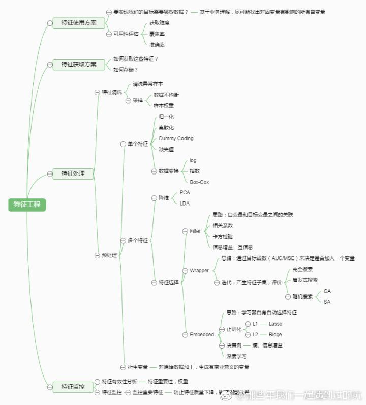
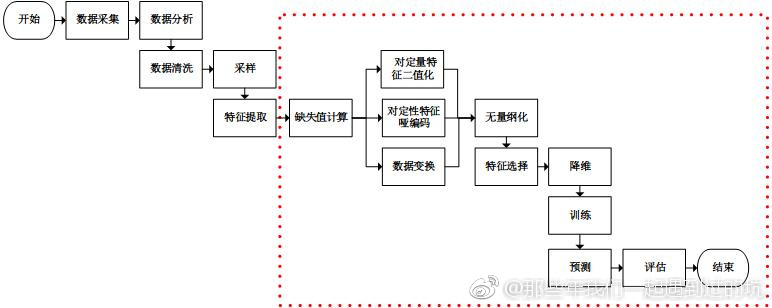
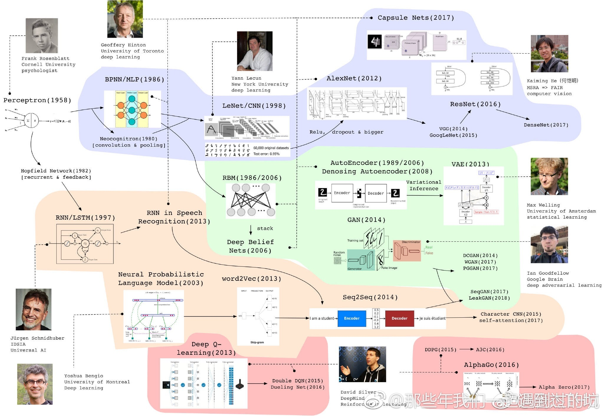
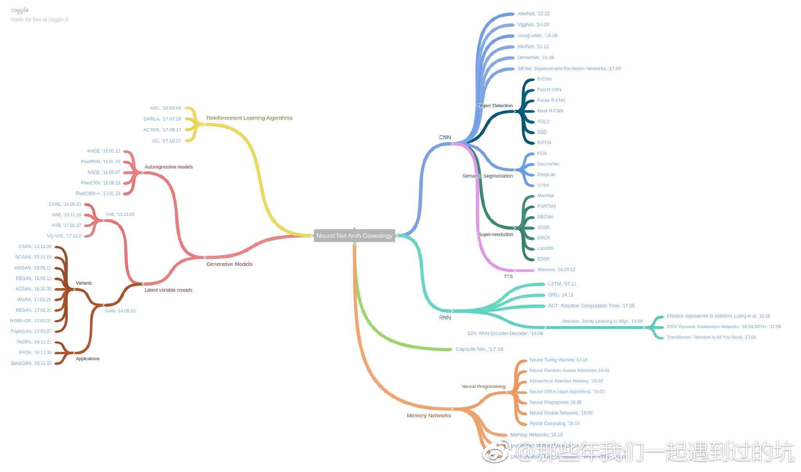
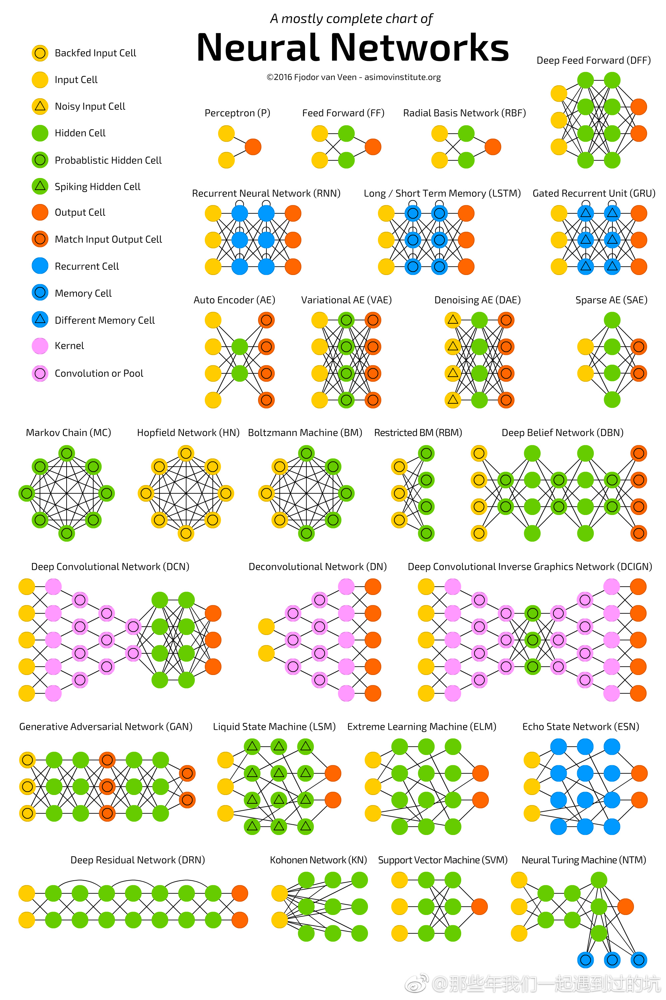

# Hello-Machine-Learning

## 机器学习框架

当前流行的机器学习框架，Scikit-learn, tensorflow, xgboost, keras, NLT, gensim, numpy, 基本上都能使用Python Anaconda安装。

TensorFlow
https://lucky521.github.io/blog/design/2017/10/26/tensorflow.html

XGBoost
https://lucky521.github.io/blog/design/2018/03/25/boosting.html

Scikit-Learn
https://lucky521.github.io/blog/design/2016/12/28/scikit-learn.html

## 机器学习方法

特征工程
https://lucky521.github.io/blog/design/2018/04/18/feature-engineering.html

模型评价
https://lucky521.github.io/blog/design/2017/01/01/metrics-to-evaluate-model.html

提升方法
https://lucky521.github.io/blog/design/2018/03/25/boosting.html

最优化方法
https://lucky521.github.io/blog/design/2018/07/31/optimization-method.html

深度学习
https://lucky521.github.io/blog/design/2017/06/14/deep-learning.html

CNN网络
https://lucky521.github.io/blog/design/2017/12/21/cnn.html

## 垂直领域应用

图像分类
https://lucky521.github.io/blog/design/2017/03/27/image-recognition.html

自然语言处理
https://lucky521.github.io/blog/design/2018/05/15/nlp-using-machine-learning.html

搜索排序
https://lucky521.github.io/blog/design/2018/02/23/search-tech.html

## 相关Repro

深度学习
https://github.com/lucky521/deep-learning

视觉图像
https://github.com/lucky521/your-face

## 机器学习公开课

### 基础课程

机器学习速成课程

    https://developers.google.com/machine-learning/crash-course/?hl=zh-cn

机器学习基础

    https://bloomberg.github.io/foml/#home

林轩田 《机器学习基石》和《机器学习技法》  

    机器学习技术课程笔记 - 台湾大学林轩田

斯坦福 CS229 Machine Learning

    有三个两个版本 https://www.coursera.org/learn/machine-learning

MACHINE LEARNING YEARNING

    https://github.com/AcceptedDoge/machine-learning-yearning-cn

### 分支课程 

斯坦福 CS224N 自然语言处理nlp-with-deep-learning

    https://web.stanford.edu/class/cs224n/

斯坦福 CS231n 深度学习与计算机视觉

    http://cs231n.github.io/
    2016版 http://study.163.com/course/courseMain.htm?courseId=1003223001
    2017版 http://www.mooc.ai/course/268

斯坦福 MS&E239 广告课程

    https://web.stanford.edu/class/msande239/

斯坦福 CS230 Deep Learning

    http://cs230.stanford.edu/
    
deeplearning.ai

    https://mooc.study.163.com/course/deeplearning_ai-2001281002#/info

# 知识图谱

# 机器学习的知识图谱

# 深度学习知识图谱

